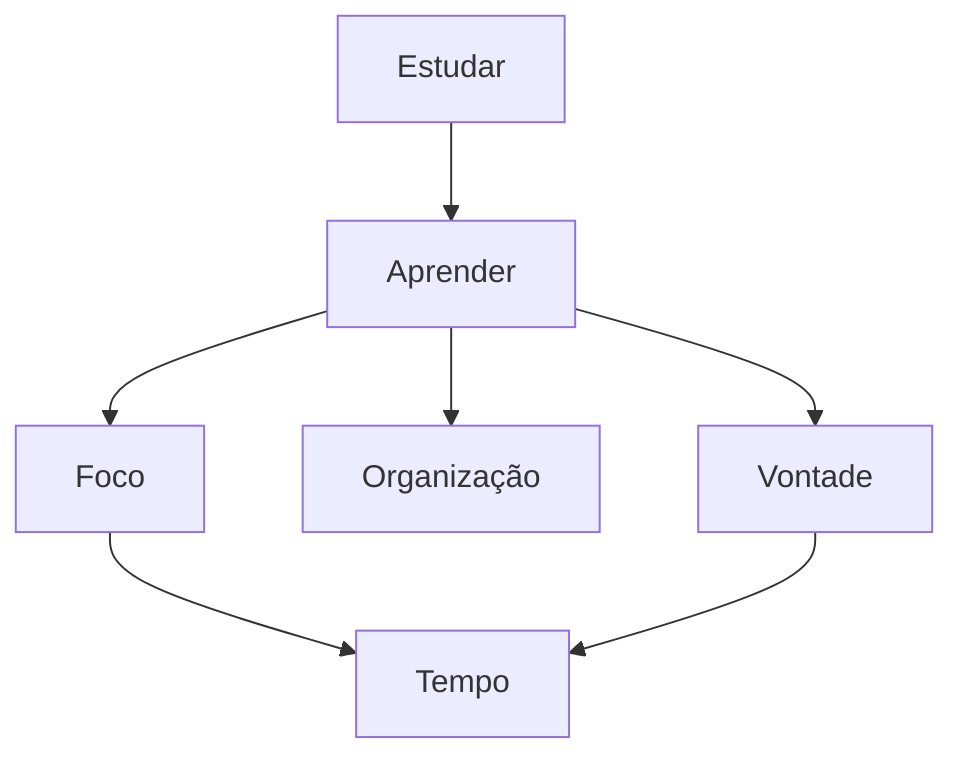

 

Cronograma de Estudos:

 
 
 

 
 

    

|   Nome   |  Botão Facilitador    |    Descrição    |
| :---         |     :---:      |          ---: |
| ` Pasta Java` | [📂](https://github.com/JoaoSchrock/Java/)     | ` Conteudo Java` |
| ` Perguntas Frequentes`     | [📂](https://github.com/JoaoSchrock/Curiosidades/) | ` Dúvidas dentro da Programação`      |
| ` Algamoney - api`     | [📂](https://github.com/JoaoSchrock/Framework/) | ` Banco de Dados` ` MySQL`       |
| ` Canal no Youtube`     |  | ` Meu canal no Youtube` ` Inscreva - se`       |
| ` Instagram`     |  | `Meu instagram Pessoal `   |
| ` Linkedin`     |  | ` Meu Linkedin Profissional`

      
 

  

